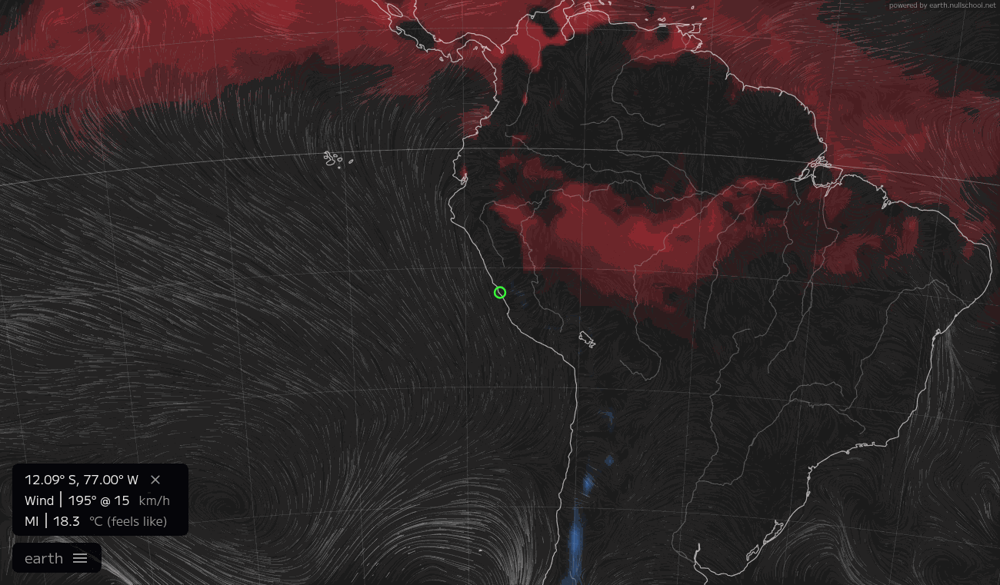
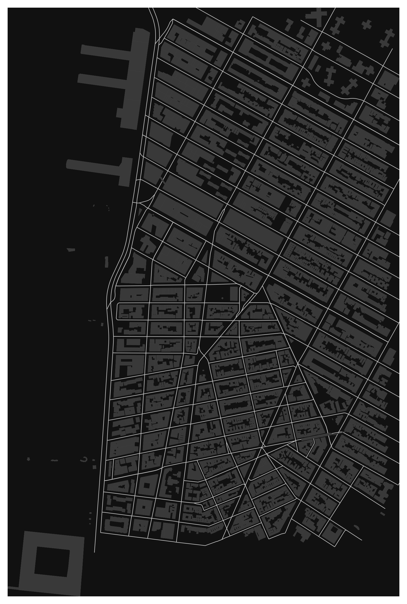

##  Who am I？


- 👨‍💻 ~~Geek~~/~~Hacker~~/~~Engineer~~/~~Scientist~~ 
- 🙇 Just a stupid **Student**.
- 💁 English name is **Ascar**. 
- 🤷 Why not Oscar?
- 🙆 According to lexicographic order
- 🤦 "A" makes me ranked **top** of ur contact list.
- 😊 Yea, it's me, a **maverick** and **funny** guy.
-   Just an edgy symbol.


## 📅 Daily Quota
<!-- START_SECTION:daily_motto -->
"Bill Gates is just a monocle and a Persian Cat away from being one of the bad guys in a James Bond movie." — Dennis Miller
<!-- END_SECTION:daily_motto -->


## 🏛️ Sanctuary of Intellect
<!-- START_SECTION:map -->
### National Museum of Qatar(25.2876, 51.5488)
<!--START_SETCTION:temp-->

<!--END:SETCTION:temp-->

Update time: 2025-03-09 13:10:11(UTC) [^1] 
<!-- END_SECTION:map -->
[^1]: Map updates every 15 mins. Powered by *[Earth.Nullschool](https://earth.nullschool.net/about.html)*, *[OSMnx](https://geoffboeing.com/publications/osmnx-paper/)*.

<!--## 📊 GitHub Stats

<p align="center">
  
  
</p>

<p align="center">
  
</p>

---
<!-- ### 🌟 GitHub Contribution Graph
<p align="center">
  
</p>

--- -->

### 📈 GitHub Activity Stats

<p align="center">
  
</p>


## 🛠️ Skills & Tech Stack
<details>
<summary>📚 Programming & Scripting Languages</summary>
<p>
  &nbsp;
  &nbsp;
  &nbsp;
  &nbsp;
  &nbsp;
  &nbsp;
  &nbsp;
  &nbsp;
  &nbsp;
</p>
</details>

<details>
<summary>🔍 Formal Verification & Theorem Provers</summary>
<p>
  &nbsp;
  &nbsp;
  &nbsp;
  &nbsp;
  &nbsp;
  &nbsp;
  &nbsp;
</p>
</details>

<details>
<summary>☁️ Backend & Cloud</summary>
<p>
  &nbsp;
  &nbsp;
  &nbsp;
  &nbsp;
  &nbsp;
  &nbsp;
  &nbsp;
  &nbsp;
  &nbsp;
  &nbsp;
  &nbsp;
  &nbsp;
  &nbsp;
  &nbsp;
  &nbsp;
</p>
</details>

<details>
<summary>🤖 AI & Data</summary>
<p>
  &nbsp;
  &nbsp;
  &nbsp;
  &nbsp;
  &nbsp;
  &nbsp;
  &nbsp;
  &nbsp;
  &nbsp;
  &nbsp;
  &nbsp;
  &nbsp;
  &nbsp;
</p>
</details>

<details>
<summary>🔐 Cybersecurity & Penetration Testing</summary>
<p>
  &nbsp;
  &nbsp;
  &nbsp;
  &nbsp;
  &nbsp;
  &nbsp;
</p>
</details>


## 📍 Where to find me
<p>
  <a href="https://github.com/Ascarshen" target="_blank">
    &nbsp;
  </a>
  <a href="https://www.linkedin.com/in/shen-ke-ascsr-8689101a3/" target="_blank">
    &nbsp;
  </a>
  <a href="mailto:ascarshen@gmail.com">
    &nbsp;
  </a>
  <a href="https://discord.com/users/ascar66" target="_blank">
    &nbsp;
  </a>
  <a href="https://join.slack.com/t/ascarshen/shared_invite/zt-xyz12345" target="_blank">
    &nbsp;
  </a>
</p>


## 📊 Weekly Development Breakdown

<!--START_SECTION:waka-->

```txt
Python       14 hrs 17 mins  ███████████████▒░░░░░░░░░   61.52 %
Markdown     5 hrs 55 mins   ██████▒░░░░░░░░░░░░░░░░░░   25.49 %
YAML         2 hrs 3 mins    ██▒░░░░░░░░░░░░░░░░░░░░░░   08.84 %
Bash         30 mins         ▓░░░░░░░░░░░░░░░░░░░░░░░░   02.19 %
JSON         11 mins         ▒░░░░░░░░░░░░░░░░░░░░░░░░   00.82 %
```

<!--END_SECTION:waka-->
