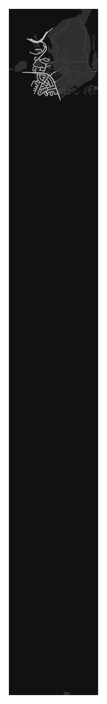

## 🚀 Who am I？


- 👨‍💻 ~~Geek~~/~~Hacker~~/~~Engineer~~/~~Scientist~~ 
- 🙇 Just a stupid **Student**.
- 💁 English name is **Ascar**. 
- 🤷 Why not Oscar?
- 🙆 According to lexicographic order, 
- 🤦 "A" makes me ranked **top** of ur contact list.
- 😊 Yea, it's me, a **maverick** and **funny** guy.
-  Just an edgy symbol...

---
## 📜 Echoe of Thought 
<!-- START_SECTION:daily_motto -->
"Each 10x jump pushes knowledge/resources to logical limits, but a 100x jump disrupts all dimensions of your problem domain. Every two zeroes, your best-kept secrets-to-success become your stinkiest instincts. To move forward, forsake your favorite skills/tools/methods/talents. Exceed yourself; become a novice again, again and again."

<div align="right"> Alex Komoroske</div>
<!-- END_SECTION:daily_motto -->

---
## 🏛️ Sanctuary of Intellect

<!-- START_SECTION:map -->
### Museum of Fine Arts (Boston)(42.3394, -71.094)
<!--START_SETCTION:temp-->

<!--END:SETCTION:temp-->

Update time: 2026-03-02 04:23:40(UTC) [^1] 
<!-- END_SECTION:map -->
---

## 📊 GitHub Stats

---

## 🛠️ Skills & Tech Stack

<details>
  <summary><strong>🖥 Programming & Scripting Languages</strong></summary>
  <p>
    
    
    
    
    
    
    
    
    
  </p>
</details>

<details>
  <summary><strong>🔒 Formal Verification & Theorem Provers</strong></summary>
  <p>
    
    
    
    
    
    
    
  </p>
</details>

<details>
  <summary><strong>🖥 AI & Backend Development</strong></summary>
  <p>
    
    
    
    
    
    
    
    
    
    
    
    
    
    
    
  </p>
</details>

<details>
  <summary><strong>🛡 Cybersecurity & Penetration Testing</strong></summary>
  <p>
    
    
    
    
    
    
  </p>
</details>

<details>
  <summary><strong>⚙️ Tools & Utilities</strong></summary>
  <p>
    
    
    
    
    
    
    
  </p>
</details>

---
## 📍 Where to find me
<p> <a href="https://github.com/Ascarshen" target="_blank">  </a>&nbsp; <a href="https://www.linkedin.com/in/shen-ke-ascsr-8689101a3/" target="_blank">  </a>&nbsp; <a href="mailto:ascarshen@gmail.com">  </a> </p>
  </a>
</p>

---
## 📊 Weekly Development Breakdown
<!--START_SECTION:waka-->

```txt
Markdown   6 hrs 46 mins         ███████████████████▓░░░░░   78.72 %
Python     59 mins               ███░░░░░░░░░░░░░░░░░░░░░░   11.49 %
HTML       18 mins               █░░░░░░░░░░░░░░░░░░░░░░░░   03.55 %
CSV        15 mins               ▓░░░░░░░░░░░░░░░░░░░░░░░░   02.93 %
CSS        9 mins                ▒░░░░░░░░░░░░░░░░░░░░░░░░   01.92 %
```

<!--END_SECTION:waka-->


[^1]: Updates every 20 minutes. Powered by [Notion](https://ash-close-8b6.notion.site/1b48dad0e6cd8040a7dff15081f5c956?v=1b48dad0e6cd815c8f48000cc979ce4e),[Nullschool](https://earth.nullschool.net/about.html) and [OSMnx](https://wiki.openstreetmap.org/wiki/OSMnx).
